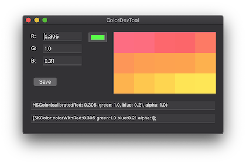

# ColorDevTools
A tiny macOS app to help me on a small task ;)

## features
- click to choose a color using macOS pickup :bowtie:
- click to it to a list
- get Swift and ObjC code
- select color from list to get code for it

## shot
 
